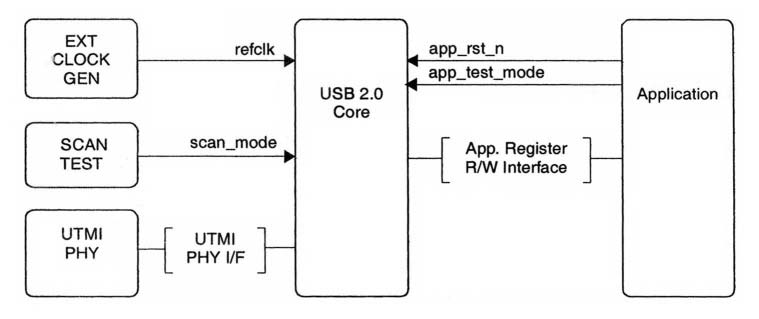
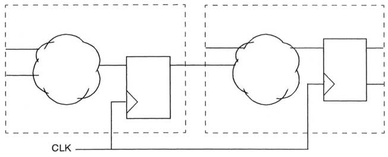
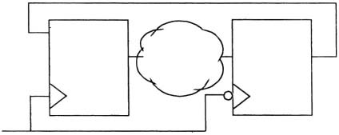
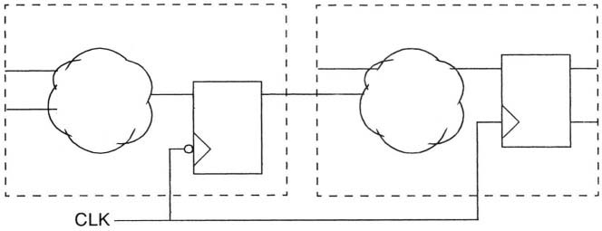
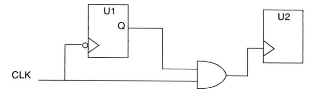
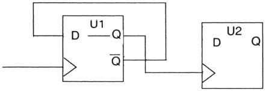
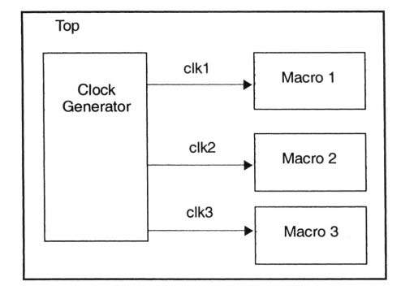

<!--
 * @Author: Gwingcyun
 * @Date: 2023-03-05 20:05:42
 * @LastEditTime: 2023-04-04 15:43:28
 * @FilePath: /Reuse-Methodology-Manual-for-System-on-a-Chip-Designs/(Kluwer) Reuse Methodology Manual for System-on-a-Chip Designs.md
 * @Description: 
 * Translation for learning and communication ONLY
-->
# 第五章 RTL编码指引
本章提供了编码规则和指引的集合。遵循这些练习有助于确保您的HDL代码是可读、可修改和可重复使用的。这些编码实践也有助于在合成和模拟中实现最佳结果。

这一章的标题包括：
- 基本编码实践 
- 可移植性编码 
- 时钟和复位指引 
- 合成编码 
- 合成分区 
- 内存设计 
- 代码分析

## 5.1 编码指引概览
本章中的编码指引基于一些基本原则。基本目标是开发简单且规范的RTL代码。与更复杂的设计相比，简单和规范的结构本质上更容易设计、编码、验证和综合。任何可重复使用设计的总体目标应该是尽可能保持简单，并仍然满足其功能和性能目标。

本章详述的编码指引提供了以下通用建议：
- 使用简单的结构、基本类型（用于VHDL）和简单的时钟方案。
- 使用一致的编码风格、一致的命名规则以及一致结构的流程和状态机。
- 使用规范的分区方案，所有模块输出都已声明为寄存器类型，模块大小大致相同。
- 通过使用注释、有意义的名称和常量或参数，而不是硬编码的数字，使RTL代码易于理解。

通过遵循这些指引，开发人员应该能够更好地生成在功能、时间、功率和区域方面快速收敛到所需性能的代码。

设计检查工具提供了一种自动检查RTL是否符合设计和编码指引的方法。

## 5.2 基本编码练习
以下指引涉及基本的编码实践，重点是词汇约定和基本的RTL结构。

### 5.2.1 通用命名习惯
**规则** - 为设计制定命名习惯。记录于文档中并在整个设计过程中巧妙地使用命名习惯。

**指引** - 所有信号名称、变量名称和端口名称都使用小写字母。

**指引** - 常量名称和用户定义类型使用大写字母。

**指引** - 为信号、端口、函数和参数使用有意义的名称。例如，不要为RAM地址总线起名为ra。作为替代，应使用ram_addr。

**规则** - 在描述多位总线时，请使用一致的位序。在VHDL中，使用`(x downto 0)`或`(0 to x)`。在Verilog中，使用`[x:0]`或`[0:x]`。使用一致的顺序有助于提高代码的可读性，并减少连接总线时意外交换顺序的意外。

**指引** - 尽管可以随意选择，但我们建议在Verilog中多位信号使用`[x:0]`，在VHDL中多位信号使用`(x downto 0)`。我们提出这个建议是为了建立一个标准，从而在多个设计和设计团队中实现一定的一致性。见示例5-1。

**示例5-1** 在端口声明中使用`[x:0]`
```
module DW_addinc (a,
                  b,
                  ci,
                  sum,
                  CO);
    input [(`WIDTH-1):0] a;
    input [(`WiDTH-1):0] b;
    input ci;
    output [(`WIDTH-1):0] sum;
    output co;
    wire [(`WIDTH-1):0] a;
    wire [(`WIDTH-1):0] b;
    wire ci;
    wire [(`WIDTH-1):0] sum;
    wire co;
endmodule
```
**指引** - 在可能的情况下，对连接的端口和信号使用相同的名称或类似的名称（例如，`a => a;`或`a => a_int;`）。

**指引** - 在可能的情况下，使用表5-1中列出的信号命名约定。
<center><b>表5-1</b></center>

| 用例    | 用法                                   |
| ------- | -------------------------------------- |
| *_r     | 寄存器输出，如 `count_r`               |
| *_a     | 异步信号，如`addr_strobe_r`            |
| \*_p*n* | *n*th phase中使用的信号，如`enable_p2` |
| *_nxt   | 进入寄存器前的的同名信号               |
| *_z     | 三态内部信号                           |

一致的命名使代码更容易阅读，特别是对其他人来说，并有助于调试、复审、维护和修改。

### 5.2.2 VITAL Support的命名规则
VITAL是VHDL库的门级建模标准，在IEEE规范1076.4中进行了描述。本规范对库文件顶层端口声明的命名规则（和其他特征）进行了限制。

通常，RTL编码样式文档不需要声明门级建模的（命名）规则。然而，其中一些问题可能会影响硬核（hard macro）开发人员。硬核的可交付成果包括全功能/全时序模型，其中将时序封装添加到RTL代码中。如果在VHDL中存在时序封装，那么它必须符合VITAL。

#### 背景
根据IEEE规范1076.4，VITAL库可以有两个级别的标准一致性：VITAL_Level0和VITAL_Level1。VITAL_Level1更严格，处理单元库的架构（功能和时序）。VITAL_Level0是处理VHDL单元库实体部分中的端口和通用规范的接口规范。VITAL_Level0对命名规则和端口/通用类型有严格的规则。这些规则旨在使仿真软件供应商可以确认某些规则，并以统一的方式处理SDF反向注释。

#### 规则
IEEE规范1076.4的规则第4.3.1节涉及端口命名约定，并包括以下规则。这些限制仅适用于硬宏的顶级实体。
**规则**（硬核，顶层端口）- 不要在硬核的顶层的实体端口声明中使用下划线字符（_）。

之所以有这条规则，是因为VITAL使用下划线作为分隔符来构造SDF条目中SDF反向注释的名称。

**规则**（硬核，顶层端口）- 在实体端口声明中，声明的端口不应为LINKAGE模式。

**规则**（硬核，顶层端口）- 实体端口声明中的类型标记应表示为在包`std_logic_1164`中声明的类型或子类型。标量端口（scalar port)声明中的类型标记应表示`std_ulogic`的子类型。数组端口声明中的类型标记应表示为`std_logic_vector`类型。
**规则**（硬核，顶层端口）- 实体端口声明中的端口不能是受保护的端口。此外，声明不能对端口施加范围约束，也不能改变标准逻辑包中定义的端口分辨率。

### 5.2.3 状态变量命名
**规则** - 对状态变量名使用独特的后缀。推荐当前状态用`<name>_cs`，下一个状态用`<name>_ns`。

### 5.2.4 在源文件规则中包含信息题头

**规则** - 包括脚本在内，在每个源文件的顶部包括一个有注释的信息题头。标题必须包含：
- 法律声明：保密、版权、复制限制 
- 文件名 
- 作者 
- 功能描述和模块关键功能列表 
- 文件创建日期 
- 修改历史记录，包括日期、修饰符名称和更改描述

示例5-2显示了示例HDL源文件题头。

**示例5-2** HDL源文件中的题头。
```
--This confidential and proprietary software may be used --only as authorized by a licensing agreement from --Synopsys Inc.
--In the event of publication, the following notice is --applicable:
-- (C)COPYRIGHT 1996 SYNOPSYS INC. -- ALL RIGHTS RESERVED
-- The entire notice above must be reproduced on all -- authorized copies.
-- File
-- Author -- Date
-- Version
-- Abstract
: DWpci_core.vhd : Jeff Hackett
: 09/17/96
: 0.1
: This file has the entity, architecture and configuration of the PCI 2.1 MacroCell core module.
The core module has the interface, config, initiator,
and target top-level modules.
-- Modification History:
-- Date By Version Change Description
================================================================================================
-- 9/17/96 JDH -- 11/13/96 JDH -- 03/04/97 SKC
0.1
Original
Last pre-Atria changes
changes for ism_ad_en_ffd_n and tsm_data_ffd_n
================================================================================================
```
示例5-2中显示的信息题头包含关键信息，供任何人查看、调试或修改文件的内容（在设计环境中）、它的用途是什么等。

### 5.2.5 使用注释
**规则** - 适当地使用注释来解释类型和子类型的进程、函数和声明。见示例5-3。

**示例5.3** 子类型声明的注释
```
--Create subtype INTEGER_256 for built-in error 
--checking of legal values.
subtype INTEGER_256 is type integer range 0 to 255;
```
**指引** - 使用注释来解释端口、信号、变量、信号组或变量组。

注释应有逻辑地放置在它们描述的代码附近。评论应简明扼要和解释清晰。避免“杂乱无章”；显而易见的功能不需要注释。关键是描述代码这样写的意图。在进程代码之前插入注释，而不是嵌入其中，以免中断代码的连贯性。

### 5.2.6 指令应在单独的行上

**规则** - 每条HDL语句应占据单独的行。虽然VHDL和Ver-ilog每行都允许多个语句，但如果每个语句或指令都在单独的行上，则代码更具可读性和更易维护。

### 5.2.7 行的长度

**指引** - 行的长度尽量不超过72个字符。

超过80个字符的行在印刷页和标准终端宽度的计算机屏幕上很难阅读。72个字符的限制提供了页边的空白，增强了代码的可读性，并为行号留出空间。对于HDL代码（VHDL或Verilog），使用回车来划分超过72个字符的行，并在下一行缩进，来表示它是上一行的延续。见示例5-4。

**示例5-4** HDL代码中行的延续
```
hp_req <= (x0_hp_req or t0_hp_req or xl_hp_req or 
    t1_hp_req or s0_hp_req or t2_hp_req or s1_hp_req or 
    x2_hp_req or x3_hp_req or x4_hp_req or x5_hp_req or 
    wd_hp_req and ea and pf_req nor iip2);
```

### 5.2.8 缩进

**规则** - 使用缩进来提高连续代码行和嵌套循环的可读性。见示例5-5。

**示例5-5** 嵌套`if`的缩进
```
if (bit_width(m+1) >= 2) then
    for i in 2 to bit_width(m+l) loop
        spin_j := 0;
        for j in 1 to m loop
            if j > spin_j then
                if (matrix(m)(i-1)(j) /= wht) then
                    if (j=m) and (matrix(m)(i)(j) = wht) then 
                        matrix(m)(i)(j) := j;
                    else
                        for k in j+1 to m loop
                            if (matrix(m)(i-1)(k) /= wht) then 
                                matrix(m)(i)(k) := j;
                                spin_j := k;
                                exit;
                            end if;
                        end loop; -- k
                    end if; 
                end if;
            end if;
        end loop; -- j
    end loop; -- i 
end if;
```

**指引** - 使用2个空格的缩进。当有几级嵌套时，较大的缩进（例如，8个空格）会限制行长。

**指引** - 避免使用tab。编辑器和用户设置的差异使tab的设置不可预测，并可能打乱预期的缩进。有相应的可用程序，如特定语言配置的emacs，这些程序将用空格替换tab。

### 5.2.9 避免使用保留词

**规则** - 不要使用VHDL或Verilog保留词来命名RTL源文件中任何元素的名称。由于宏单元设计必须从VHDL转换成Verilog，从Verilog转换成VHDL，因此重要的是不要在Verilog代码中使用VHDL保留字，也不要在VHDL代码中使用Verilog保留字。

### 5.2.10 端口排序

**规则** - 以逻辑顺序声明端口，并在整个设计中保持此顺序一致。

**指引** - 每行声明一个端口，接上注释（最好在同一行上）。

**指引** - 对于每个接口，按以下顺序声明端口：

*Inputs:*
- Clocks
- Resets
- Enables
- Other control signals 
- Data and address lines
- 
*Outputs:*
- Clocks
- Resets
- Enables
- Other control signals 
- Data

**指引** - 用注释来描述端口组。

图5-1和示例5-6说明了端口排序规则和指引。


<center><b>图5-1</b> USB 2.0 核心接口</center>
</br>
示例5-6 图5-1的端口排序
Example 5-6 Port ordering for Figure 5-1 

```
module DW_usbd(
         // External Clock Generator: Inputs
refclk,  // Main Reference Clock
Scan Test Interface: Inputs
scan_mode      ,  // For scan testing
                  // UTMI PHY (type 2/3) Interface: Inputs
                  // Enables
phy23_rxvalid  ,  // Specifies the valid data LSB
phy23_rxvalidh ,  // Specifies the valid data on MSB 
phy23_txready  ,  // Valid data will be polled
                  // Other control signals 
phy23_linestate,  //Current state of dp, dmlines
phy23_rxerror  ,  // Error in received data 
phy23_rxactive ,  // PHY needs to transmit data
                  // Data and address lines
  
  
phy23_rx_data,  // 16-bit unidir receive data bus

  // UTMI PHY (type 2/3) Interface: Outputs
  // Reset


phy23_reset      ,  // Reset signal to the PHY
                    // Enables
phy23_reset      ,  // Suspend signal to the PHY 
phy23_xcvr_select,  // Select HS or FS transceiver

                // Application Interface: Inputs 
                // Resets
app_rst_n    ,  // Asynchronous reset 
app_test_mode,  // Bypassing USB reset

               // APP Register R/W Interface: Inputs
               // Enables
app_16bit   ,  // APP 16-bit r/w access
app_reg_sel ,  // APP Register Interface select
               // Other control signals
app_rd_n    ,  // APP register-read command
app_wr_n    ,  // APP register-write command
               // Data and address lines
app_addr    ,  // APP Register address bus
app2usb_data,  // APP Write-data bus 

  // APP Register R/W Interface: Outputs

               // Other control signals
usb2app_drdy,  // Data ready indication from
               // DW_usbd to APP
               // Data and address lines 
usb2app_data,  // APP Read-Data bus

    //
    // <other APP interface input signals>
    // <APP interface output signals>
);  // DW_usbd
```
### 5.2.11 端口映射和类属（generic）映射
**规则** - 始终对端口和类属使用显式映射，使用命名关联而不是位置关联。见示例5-7。

&#160;&#160;&#160;&#160;**VHDL:**
```
U_int_txf_ram : DW_ram_r_w_s_dff generic map (
    data_width => ram_data_width+ram_be_data_width,
    depth      => fifo_depth,
    rst_mode   => 1
)
PORT map (
clk      => refclk,
rst_n    => int_txfifo_ram_reset_n,
cs_n     => logic_zero,
wr_n     => int_txfifo_wr_en_n,
rd_addr  => int_txfifo_rd_addr,
wr_addr  => int_txfifo_wr_addr,
data_in  => int_txfifo_wr_data,
data_out => txf_ram_data_out
);
```
&#160;&#160;&#160;&#160;**Verilog:**
```
DW_ram_r_w_s_dff
  #((`ram_data_width+`ram_be_data_width),
    (`fifo_depth),1) 
    U_int_txf_ram (
     .clk       (refclk),
     .rst_n     (txfifo_ram_reset_n), 
     .cs_n      (1'b0),
     .wr_n      (txfifo_wr_en_n), 
     .rd_addr   (txfifo_rd_addr), 
     .wr_addr   (txfifo_wr_addr),
     .data_in   (txfifo_wr_data), 
     .data_out  (txf_ram_data_out)
);
```
### 5.2.12 VHDL实体、架构和配置部分
**指引** - 将VHDL设计的实体、架构和配置部分放在同一个文件中。将有关特定设计的所有信息放在一个文件中，使设计更容易理解和维护。如果源文件中包含带有实体和架构声明的配置，为了综合，它们必须被注释掉。您可以使用VHDL源文件中的`pragma translate_off`和`pragma translate_on`伪注释执行此操作，如示例5-8所示。

**示例5-8** 使用pragmas注释用于综合的VHDL配置
```
-- pragma translate_off
configuration cfg_example_struc of example is
  for struc
    use example_gate;
  end for;
end cfg_example_struc; 
-- pragma translate_on
```

### 5.2.13 使用函数（functions）
**指引** - 尽可能使用函数，而不是重复相同的代码。可以的话，泛化函数使其可复用。比如说在您的代码中，地址数据经常从一种格式转换为另一种格式，请使用函数执行转换，并在需要时调用该函数。见示例5-9。

**示例5-9** 创建一个可复用的函数

&#160;&#160;&#160;&#160;**VHDL:**
```
-- This function converts the incoming address to the 
-- corresponding relative address.
function convert_address 
    (input_address, offset : integer)
return integer is 
begin
    -- ... function bodygoes here . . . 
end; -- convert_address
```
&#160;&#160;&#160;&#160;**Verilog:**
```
// This function converts the incoming address to the // corresponding relative address.
function [` BUS_WIDTH-1:0] convert_address; input input_address, offset;
    integer input_address, offset;
    begin
        // ... function body goes here ...
    end
endfunction // convert_address
```

### 5.2.14 使用循环和数组(loops and arrays)
**指引** - 使用循环和数组改善源代码的可读性。例如，用来描述带有循环结构的移位寄存器、PN序列生成器或Johnson计数器可以大大减少源代码的行数，同时仍然保持出色的可读性。见示例5-10。

**示例5-10** 使用循环提高可读性

```
shift_delay_loop: for i in 1 to (number_taps-l) loop 
    delay(i) := delay(i-1);
end loop shift_delay_loop;
```

数组（`array`）结构还减少了描述函数所需的语句数量，并提高了可读性。示例5-11是作为触发器二维数组实现的寄存器组（register bank）的示例。

**示例5-11** 使用数组描述的寄存器组
```
type reg_array is array(natural range <>) of 
    std_logic_vector(REG_WIDTH-1 downto 0);
signal reg: reg_array(WORD_COUNT-1 downto 0);
begin
    REG_PROC: process(clk) 
    begin
        if clk='1' and clk'event then 
            if we='1' then
                reg(addr) <= data;
            end if; 
        end if;
    end process REG_PROC;
    data_out <= reg(addr);
```

**指引** - 数组的仿真速度比`for`循环快得多。为了提高仿真性能，尽可能在数组上使用向量运算（vector operations），而不是`for`循环操作。见示例5-12。

**示例5-12** 使用数组进行更快的仿真

&#160;&#160;&#160;&#160;**较差的编码风格:**
```
function my_xor( bbit : std_logic;
                    avec : std_logic_vector(x downto y) )
    return std_logic_vector is 
variable cvec :
    std_logic_vector(avec'range-1 downto 0); 
begin
    for i in avec'range loop         -- bit-level for loop 
        cvec(i) := avec(i) xor bbit; -- bit-level xor
    end loop;
    return(cvec); 
end;
```
&#160;&#160;&#160;&#160;**推荐的编码风格:**
```
function my_xor( bbit : std_logic;
                    avec : std_logic_vector (x downto y) )
    return std_logic_vector is 
variable cvec, temp :
    std_logic_vector(avec' range-1 downto 0); 
begin
    temp := (others => bbit); 
    cvec := avec xor temp; 
    return(cvec);
end;
```

### 5.2.15 使用有意义的标签（labels）

**规则** - 用有意义的名称标记每个进程块。这对调试非常有帮助。例如，您可以通过引用进程标签来设置断点。

**指引** - 用`<name>_PROC`标记每个进程块。

**规则** - 用有意义的名称标记每个实例。

**指引** - 用`U_<name>`标记每个实例。

在多层设计层次结构中，保持标签简短而有意义。长进程和实例标签可能会导致设计层次中的路径名称过长。见示例5-13。

**规则** - 不要复制任何信号、变量或实体名称。例如，如果您有一个名为`incr`的信号，不要使用`incr`作为进程标签，而是使用`incr_prc`。这更好地将名称与其使用联系起来，并避免了一些工具在名称重复时出现的问题。

**示例5-13** 有意义的进程标签

```
-- Synchronize requests (hold for one clock).

SYNC_PROC : process (reql, req2, rst, clk) 
    ... process body here ...

end process SYNC_PROC;
```

## 5.3 可移植性编码

以下指引解决了可移植性问题。通过遵循这些指引，您可以创建与技术无关的代码，与各种模拟工具兼容，并且可以轻松地从VHDL转换成Verilog（或从Verilog转换成VHDL）。

### 5.3.1 仅使用IEEE标准类型（VHDL）

您可以创建其他类型和子类型，但所有类型和子类型都应基于IEEE标准类型。示例5-14展示了如何基于IEEE标准类型`std_logic_vector`创建子类型（`word_type`）。

**规则（仅限VHDL）**- 仅使用IEEE标准类型。

您可以创建其他类型和子类型，但所有类型和子类型都应基于IEEE标准类型。示例5-14展示了如何基于IEEE标准类型`std_logic_vector`创建子类型（`word_type`）。

**示例5-14** 从`std_logic_vector`创建一个子类
```
    --Create new 16-bit subtype
    subtype WORD_TYPE is std_logic_vector (15 downto 0);
```

## 5.4 时钟和复位指引

以下部分包含时钟和重置信号的指引。这些指引背后的基本理论是，一个简单的时钟结构更容易理解、分析和维护。它的综合效果一贯地好。如图5-2所示，一个更好的时钟结构是单一全局时钟（global clock）和正边沿触发flops作为唯一的时序设备。


<center><b>图5-2</b> 理想时钟结构</center>

### 5.4.1 避免混合时钟边沿

**指引** - 避免在设计中使用正边沿和负边沿触发flip-flops。

在某些设计中，可能需要混合时钟边沿。例如，在时序要求严苛的设计中，可能需要在两个时钟边沿捕获数据。然而，两个边沿的时钟都会产生一些问题，应该谨慎使用：
- 除了时钟频率本身外，时钟的占空比也成为时序分析中的关键问题。
- 大多数基于扫描的测试方法要求单独处理正边沿和负边沿缘触发的flops。

图5-3显示了具有正边沿触发触发flip-flops的模块示例。


<center><b>图5-3</b> 错误示例：混合时钟边沿</center>

**规则** - 如果您必须在设计中正边沿和下边沿触发flip-flops，请务必在同步和时序分析中准确模拟时钟的最坏情况占空比。

假设具有50%占空比的完美时钟是乐观的，信号用半个时钟周期从一个寄存器传播到下一个寄存器。在物理设计中，占空比并不完美，信号传送的实际时间可能小得多。

**规则** - 如果您必须在设计中使用正边沿和负边沿触发触发的flip-flops，请务必在用户文档中记录假定的占空比。

在大多数芯片设计中，占空比是插入设计中的时钟树（clock tree）的函数；这种时钟树插入通常是工艺技术特定。使用macro的的芯片设计者必须检查实际占空比是否与macro的要求相匹配，并且必须知道如何更改macro的综合/时序分析脚本以匹配实际条件。

**指南** - 如果您在设计中必须使用大量正边沿触发flip-flops，将它们分离到不同的模块中可能会很有用。这使得识别负边沿翻转更容易，从而将它们放在不同的扫描链中。

图5-4显示了一个示例设计，其中正边沿触发flip-flops和负边沿触发flip-flops被划分为单独的块。


<center><b>图5-4</b> 更好的示例：负边沿和正边沿触发的flip-flops是分开的</center>

### 5.4.2 避免时钟缓冲（clock buffer）

**指引** - 避免在RTL代码中手动实例化时钟缓冲。时钟缓冲通常在合成后综合，作为物理设计的一部分。在可综合的RTL代码中，时钟网通常被认为是理想的网，没有延迟。在布局布线中，时钟树插入工具插入适当的结构，以创建尽可能接近理想、平衡的时钟分配网络。

### 5.4.3 避免门控时钟

**指引** - 避免在RTL中写门控时钟。时钟门控电路往往是技术特定和时序依赖。门控时钟的时机不当可能会产生错误的时钟或毛刺（glitch），导致flip-flop输入错误的数据。此外，不同局域时钟的倾斜可能会导致违反保留时间。

门控时钟也会导致测试性有限，因为门控时钟的逻辑时钟不能成为扫描链的一部分。图5-5显示了一种设计，即U2在scan-in、测试或scan-out时无法计时，也不能成为扫描链的一部分。

许多低功耗设计都需要门控时钟，但它们不应该在RTL中成为macro。有关处理门控时钟的首选方式，请参阅章节5.4.5“门控时钟和低功耗设计”。如果独立的flip-flops需要在设计中门控，时钟门控应该由电源同步工具插入，以便RTL保持技术可移植性。

<div align="center">

</div>
<p align="center"><b>图5-5</b> 错误示例：门控时钟较差的测试性以及时钟偏移（skew）问题</p>

### 5.4.4 避免内部生成的时钟

**指引** - 避免在设计中使用内部生成的时钟。

内部生成的时钟导致可测试性有限，因为由内部生成的时钟驱动的逻辑不能成为扫描链的一部分。内部生成的时钟也使得约束综合设计变得更加困难。

图5-6显示了一种设计，其中U2在scan-in、测试或scan-out期间不能计时，也不能成为扫描链的一部分，因为它是设计内部生成的时钟。用同步设计或使用多个时钟作为替代。

<div align="center">

</div>
<p align="center"><b>图5-6</b> 错误示例：内部生成的时钟</p>

### 5.4.5 门控时钟和低功耗设计

一些设计，特别是低功耗设计，需要门控时钟。以下指引将解决该问题。

**指引** - 如果您必须使用门控时钟或内部生成的时钟或复位，请将时钟和/或复位产生电路作为单独的模块保留在设计的顶层。分区设计，以便单个模块中的所有逻辑都使用单个时钟和单个复位。见图5-7。

需要注意，时钟门控电路永远不应该出现在macro中。如果需要，时钟电路应出现在设计层次结构的顶层，如图5-7所示。

在单独的模块中隔离时钟和复位生成逻辑可以解决许多问题。它允许子模块1-3使用标准时序分析和扫描插入技术。这样，相较于仔细检查行为是否正确，将RTL编写指引的例外情况限制在一个小模块。它还使设计团队更容易为时钟/复位产生逻辑开发特定的测试策略。


<center><b>图5-7</b> 更好的示例：独立于顶层的时钟产生电路</center>

**示例5-17** 使用同步载入取代组合门控

&#160;&#160;&#160;&#160;**较差的编码风格:**

```
assign clk_p1 = clk and p1_gate; 
always @(posedge clk_p1)
    begin : ex5-17a_proc

    end // ex5-17a_proc
```

&#160;&#160;&#160;&#160;**推荐的编码风格:**

```
always @(posedge clk)
    begin : ex5-17b_proc
        if (p1_gate == 1' b1)
        begin
            ...
        end
    end // ex5-17b_proc
```
### 5.4.6  避免内部生成复位

确保您的寄存器仅由简单的复位信号控制。

**指引** - 尽可能避免内部生成条件判断复位。通常，macro中的所有寄存器都应同时复位。这种方法使分析和设计变得更加简单和容易。

**指引** - 如果需要条件判断的复位，请为复位信号建立一个单独的信号，并在单独的模块中隔离条件判断的复位逻辑，如示例5-18所示。这种方法使代码可读性更好，并改善了综合结果。

**示例5-18** 隔离的条件判断复位逻辑

&#160;&#160;&#160;&#160;**较差的编码风格:**
```
always @(posedge clk or posedge rst or posedge a) 
    begin : ex5-18a_proc
        if (rst || a)    
            reg_sigs <= 1' b0;
        else begin ...
    end
end // ex5-18a_proc
```

&#160;&#160;&#160;&#160;**推荐的编码风格:**
```
// in a separate reset module

assign z_rst = rst || a

//in the main module

always @ (posedge clk or posedge z_rst)
    begin : ex5-18b_proc
        if (z_rst)
            reg_sigs <= 1' b0; 
        else begin
    end
end // ex5-18b_proc
```

### 5.4.7 复位逻辑函数

**指引** - 复位信号的*唯一*逻辑功能应该是直接清除所有触发器。切勿使用翻牌的重置输入来实现状态机功能。在翻牌上保留重置引脚进行重置只会使生成重置的缓冲树更容易。

# 第六章 宏单元综合指引
本章讨论了开发宏单元综合脚本的策略，这些脚本使积分电路能够综合宏单元并满足时序要求。本章重点包括：
- 合成问题概述 
- 复用宏单元的综合策略 
- 高性能综合
- RAM和数据通路生成器 
- 综合脚本的编码指引

## 6.1 综合问题概览
参数化软核（soft macro）的综合存在一些特殊问题：
- 宏单元和综合脚本必须允许积分电路综合宏并满足芯片成品中的时许要求。
- 宏单元必须满足积分电路门阵列或标准单元库的时序。
- 宏单元必须在积分电路的特定宏单元配置中满足时序。

本章介绍了一套实现这些目标的工具和方法。

本章的综合指引基于指导上一章的许多相同基本原则。首先，综合和时序设计必须从宏单元设计周期开始。

即：
- 宏单元的功能规格必须描述设计的时序、面积和功率要求。
- 对于较大的时序关键块，宏单元及其各种子块的详细技术规格必须详细描述时序要求和接口，包括输入和输出延迟和加载的规格。RTL需要从一开始就编码，以满足设计的功能和时间要求。首先为功能编码，然后修复定时问题，在许多设计中会导致重大延迟和整体性能不佳。